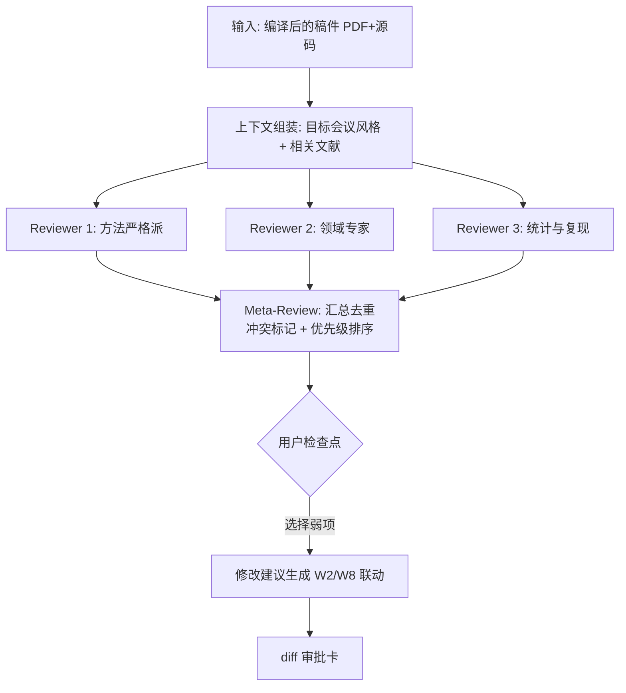
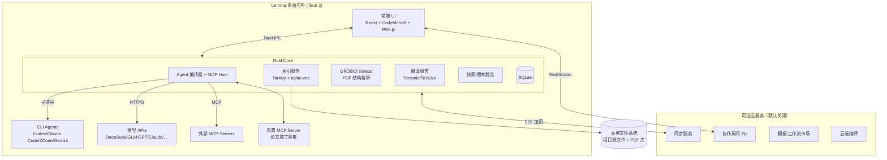

# Lemma — AI 原生的一站式科研写作工作站 · 完整设计文档

> 工作代号：**Lemma**（命名候选见附录 A）
> 版本：Design v1.0 · 2026-09-30
> 定位一句话：**"IDE for Papers" —— 把 Overleaf 的写作体验、Codex/ZCode 的 Agent 能力、Zotero 的文献管理、SciSpace 的 AI 调研，融合为一个本地优先的桌面级科研全流程工作站。**
>
> 本文档描述的是**终态成熟产品**的完整设计。第 9 章给出的是把这份蓝图工程落地的并行执行计划（集成里程碑），而非产品功能迭代路线。

---

## 目录

1. [愿景与定位](#1-愿景与定位)
2. [用户与全流程旅程](#2-用户与全流程旅程)
3. [产品总体设计](#3-产品总体设计)
4. [模块详细规格](#4-模块详细规格)
   - 4.1 文献调研 Discovery
   - 4.2 文献库与阅读 Library & Reader
   - 4.3 写作工坊 Write
   - 4.4 引用与学术诚信 Citation Integrity
   - 4.5 Agent 中枢 Agent Hub（核心差异化）
   - 4.6 智能审稿与投稿 Review & Submit
   - 4.7 知识底座 Knowledge
   - 4.8 工作区底座 Workspace
5. [多 Agent 架构设计](#5-多-agent-架构设计)
6. [技术架构](#6-技术架构)
7. [生态与开放性](#7-生态与开放性)
8. [产品化与商业化](#8-产品化与商业化)
9. [工程执行计划（并行工作流）](#9-工程执行计划并行工作流)
10. [风险登记册](#10-风险登记册)
11. [开放问题清单](#11-开放问题清单)
12. [附录](#12-附录)

---

## 1. 愿景与定位

### 1.1 问题陈述

一名研究者产出一篇论文，今天需要横跨 **8–12 个互不打通的工具**：

| 阶段 | 现状工具 | 痛点 |
|---|---|---|
| 选题与调研 | Google Scholar / Web of Science / Elicit / SciSpace | 各库割裂，检索结果无法沉淀 |
| 文献管理 | Zotero / Mendeley / EndNote | 与写作环境割裂，引用同步靠插件 |
| 阅读 | Acrobat / Zotero 阅读器 / 平板 | 笔记、高亮、AI 问答散落各处 |
| 写作 | Overleaf / 本地 VS Code + LaTeX Workshop | Overleaf 无本地 agent 能力；本地环境配置门槛高 |
| AI 辅助 | ChatGPT 网页 / Writefull / Jenni | 上下文靠手工复制粘贴，无法操作工程（编译、改引用、查文献） |
| 审稿修改 | 邮件 + Word 批注 | 审稿意见、rebuttal、修改稿三头管理 |
| 投稿 | 期刊投稿系统 + 期刊官网 | 格式 checklist 靠人肉，一文多投重复劳动 |

**核心断裂点**：AI（Codex/Claude/ZCode 这类能实际"动手"的 agent）从来没有被接入到论文工程里——它们被挡在"只能聊天"的盒子里，看不到文献库、跑不了编译、改不了引用。而 Overleaf 这类写作平台又完全闭门于本地 agent 生态之外。

### 1.2 使命

> **让研究者在一个软件内完成从选题调研到见刊发表的全部工作，并让 AI Agent 作为一等公民深入每个环节——能读你的文献库、能编译你的论文、能核查你的引用、能模拟你的审稿人。**

### 1.3 产品哲学（五原则）

1. **本地优先（Local-first）**：论文是高度敏感的未发表成果。所有数据默认存本地（plain files + SQLite），AI 默认只发送必要上下文，云端功能全部可选、端到端加密。
2. **AI 原生（AI-native）**：不是"编辑器 + 侧边栏聊天"，而是 agent 拥有工具（Tool Use）：检索文献库、读取 PDF、编译 LaTeX、以 diff 形式修改稿件、核查引用。人类通过检查点审批每一步。
3. **全流程（End-to-end）**：调研 → 阅读 → 写作 → 审稿 → 投稿 → 发表，一个工作区内闭环，数据不搬家。
4. **开放生态（Open）**：模型可插拔（BYOK）、agent 可插拔（本地 CLI / API / MCP）、模板与工作流可共享（市场）。
5. **学术诚信（Integrity by design）**：AI 改动全程留痕可回滚；引用必须本地验证、禁止幻觉引文；内置各期刊 AI 使用声明的合规助手。

### 1.4 竞品全景与差异化

| 能力维度 | Overleaf | Zotero | SciSpace/Elicit | Jenni/Writefull | Cursor/Codex | **Lemma** |
|---|---|:---:|:---:|:---:|:---:|---|
| LaTeX 写作 + 实时编译 | ★★★ | ✗ | ✗ | ✗ | △（需配置） | ★★★（本地 Tectonic/TeX Live + 增量编译 + SyncTeX） |
| 多人文档协作 | ★★★ | △ | ✗ | ✗ | ✗ | ★★☆（本地优先 + 可选云房间 CRDT） |
| 文献管理 | △ | ★★★ | △ | ✗ | ✗ | ★★★（Zotero 级 + Better-BibTeX 兼容 citekey） |
| PDF 阅读 + 标注 | △ | ★★☆ | △ | ✗ | ✗ | ★★★（标注联动笔记与 RAG） |
| AI 文献调研/综述 | △ | ✗ | ★★☆ | ✗ | ✗ | ★★★（agent 驱动，结果全部落库可验证） |
| AI 深度参与写作工程 | ✗ | ✗ | ✗ | ★☆（仅文本层） | ★★★（但不懂论文域） | ★★★（**域工具集**：编译、引用、图表、审稿） |
| 可插拔多模型/多 agent | ✗ | ✗ | ✗ | ✗ | ★★☆ | ★★★（CLI agent / API / MCP 三类适配器） |
| 审稿模拟 / rebuttal 工作台 | ✗ | ✗ | ✗ | ✗ | ✗ | ★★★（独有） |
| 投稿工作流（模板/checklist/迁移） | △（模板） | ✗ | ✗ | ✗ | ✗ | ★★★ |
| 数据主权 / 离线可用 | ✗（云） | ★★☆ | ✗ | ✗ | ★★☆ | ★★★（完全离线可用，BYOK 免费） |

**护城河判断**：
- 单点功能都有人做，但**"agent 拥有论文域工具集 + 全流程数据在一个库"** 的组合没有竞品。数据闭环（文献库↔写作↔审稿↔投稿）一旦形成，迁移成本极高。
- 本地 CLI agent（Codex CLI / Claude Code / ZCode / Gemini CLI）生态正在爆发，但它们都缺一个**面向论文的宿主（host）**——Lemma 就是那个宿主，为它们提供文献库工具、编译服务、diff 审批 UI。这与 "终端 + IDE" 的关系同构。

### 1.5 与 "IDE" 的同构（产品设计的主隐喻）

| IDE 概念 | Lemma 对应物 |
|---|---|
| 编辑器 + LSP | LaTeX 编辑器 + LaTeX Language Server（补全/诊断/重命名 label） |
| Build / 任务 | LaTeX 编译链（Tectonic / TeX Live / latexmk） |
| 终端 + AI Chat | Agent 面板（会话、工作流、diff 审批） |
| Debugger | 编译错误 quickfix + latexdiff 修改对比视图 |
| Git | 内置版本控制（每次 AI 修改自动快照） |
| 插件市场 | 模板市场 + Agent 工作流市场 + MCP 工具 |
| Workspace | 科研项目（Project = 一篇论文的完整工作区） |

---

## 2. 用户与全流程旅程

### 2.1 Personas

| Persona | 场景 | 关键诉求 |
|---|---|---|
| **P1 博士生（主力，60%）** | 第一次写 SCI/顶会论文，英文写作吃力，文献读不完 | AI 润色/翻译、文献速读、审稿人视角预演、引用不出错 |
| **P2 博后/研究员（25%）** | 高产输出，多稿并行，一文多投 | 多项目管理、格式转换、投稿追踪、个人风格一致性 |
| **PI / 导师（10%）** | 批改学生稿件，团队文献库 | 批注协作、共享库、修改痕迹、学生进度 |
| **P4 产业研究员 / 独立研究者（5%）** | 无机构订阅，数据敏感 | 本地部署、BYOK、数据不出机器 |

### 2.2 全流程旅程（产品必须覆盖的 10 个阶段）

```
选题 → 调研 → 精读 → 实验(外部) → 起草 → 打磨 → 内审 → 投稿 → Rebuttal → 见刊/宣传
  │      │       │                │      │      │      │      │        │        │
  │      │       │                │      │      │      │      │        │        └─ 一页总结/宣讲图/社交媒体帖生成
  │      │       │                │      │      │      │      │        └─ 逐条回复工作台 + latexdiff 修改稿
  │      │       │                │      │      │      │      └─ 期刊推荐、格式 checklist、cover letter、打包
  │      │       │                │      │      │      └─ Reviewer 仿真、弱点分析、预提交自检
  │      │       │                │      │      └─ 图表打磨、术语一致性、全文润色、查重自检
  │      │       │                │      └─ 分节起草（含相关文献上下文注入）
  │      │       │                └─ 实验数据/代码外部完成，结果导入图表工坊
  │      │       └─ PDF 阅读器 + AI 问答/翻译/笔记卡片，喂入知识库
  │      └─ 聚合检索 + AI 筛选 + 综述初稿 + 引文网络
  └─ 选题板：从知识库缝隙与趋势分析中发现方向
```

每个阶段在产品中都对应具体模块（第 4 章），阶段之间的**数据不换载体**——这是全流程闭环的核心体验。

---

## 3. 产品总体设计

### 3.1 功能全景图（六大模块 + 一个底座）

```
┌─────────────────────────────────────────────────────────────────────┐
│                        Lemma 桌面应用                          │
├───────────────┬───────────────┬───────────────┬─────────────────────┤
│ ① 文献调研     │ ② 文献库&阅读  │ ③ 写作工坊     │ ④ 引用与诚信         │
│  Discovery    │  Library      │  Write        │  Citation Integrity │
│  聚合检索      │  元数据管理    │  LaTeX 编辑器  │  BibTeX 管理         │
│  AI 筛选      │  PDF 阅读器   │  编译链        │  引用核查            │
│  引文网络      │  标注/笔记    │  模板向导      │  AI 改动审计         │
│  趋势/订阅     │  智能过滤器    │  图表工坊      │  查重自检            │
├───────────────┴───────────────┴───────────────┴─────────────────────┤
│              ⑤ Agent 中枢 Agent Hub（横跨所有模块）                   │
│   会话式助手 · 工作流编排 · 多 agent 调度 · diff 审批 · 成本路由        │
├───────────────┬───────────────┬───────────────┬─────────────────────┤
│ ⑥ 审稿与投稿   │ ⑦ 知识底座     │ ⑧ 工作区底座                        │
│  Reviewer 仿真 │  RAG 问答     │  版本控制(Git) · 快照 · 云同步(可选)   │
│  投稿 checklist│  卡片/双链笔记 │  实时协作(可选云房间) · 多设备伴侣     │
│  期刊推荐      │  术语表/风格档 │  命令面板 · 全局搜索 · 插件系统        │
└───────────────┴───────────────┴─────────────────────────────────────┘
```

### 3.2 主界面信息架构

默认三栏工作区（可自由重组为阅读模式 / 写作模式 / 审稿模式三套预设布局）：

```
┌────────────────────────────────────────────────────────────────────────┐
│ 菜单  [⌘K 命令面板]                    编译 ● 成功 3.2s   Git ◐  同步 ↑ │
├─────────┬────────────────────────────────────────┬────────────────────┤
│ 导航栏   │  编辑器 / 阅读器（主区域，可分屏）         │  Agent 面板         │
│ ├ 大纲   │  main.tex  ▸ main.pdf  ▸ notes.md      │  ┌──────────────┐  │
│ ├ 文件   │                                        │  │ 活动工作流:    │  │
│ ├ 引用   │  \section{Introduction}                │  │ 润色 Introduction│ │
│ ├ 图表   │  Recent advances in [...]              │  │ ▸ diff 预览    │  │
│ ├ 任务   │                                        │  │ ▸ 引用核查: 2⚠ │  │
│ ├ 投稿   │                                        │  │ [采纳] [回滚]  │  │
│         ├────────────────────────────────────────┤  └──────────────┘  │
│ 文献库   │  PDF 预览（SyncTeX 正反向跳转）           │  上下文: 相关文献3  │
│ (过滤)   │                                        │  术语表 · 风格档    │
└─────────┴────────────────────────────────────────┴────────────────────┘
```

**关键交互范式**：
- **命令面板（⌘K）**：一切功能可搜索触达（类 VS Code / Raycast）。
- **Agent 面板**：常驻右侧，承载会话、长任务工作流、diff 审批卡片。
- **选中即问（Ask-on-selection）**：编辑器/PDF 中选中任意文本 → 浮出 AI 操作条（解释/改写/翻译/找反例文献/加入术语表）。
- **一切 AI 修改皆 diff**：agent 对稿件的任何修改以 latexdiff 呈现，采纳/逐条采纳/回滚三选。

### 3.3 核心概念模型

| 概念 | 定义 | 类比 |
|---|---|---|
| **Project（科研项目）** | 一篇论文的完整工作区：LaTeX 源文件 + 关联文献集合 + 笔记 + 投稿记录 | IDE Workspace / Repo |
| **Library（文献库）** | 全局或项目级的文献条目 + PDF 附件 + 标注 | Zotero Library |
| **Corpus（语料）** | 已建立全文索引与向量索引的文献子集，供 RAG | — |
| **Context Pack（上下文包）** | 注入给 agent 的项目上下文：大纲、术语表、风格档案、相关文献摘要、期刊要求 | AGENTS.md / CLAUDE.md |
| **Agent Run** | 一次 agent 任务执行的完整记录：输入、工具调用链、diff、token 成本 | CI Job |
| **Workflow（工作流）** | 预制或用户自定义的多步骤 agent 编排（如"三审稿人仿真"） | GitHub Action |
| **Snapshot（快照）** | 自动或手动的项目状态存档，AI 修改前强制快照 | Git commit |

---

## 4. 模块详细规格

> 每个模块给出：功能清单（P0 = v1.0 成熟版必备 / P1 = v1.x / P2 = 远期）、关键交互、数据流与验收标准。

### 4.1 文献调研 Discovery

**目标**：把"检索—筛选—沉淀"变成一个动作。检索结果不是网页，而是直接落库的文献条目。

| # | 功能 | 优先级 | 说明 |
|---|---|:---:|---|
| D-1 | 聚合检索 | P0 | 一处搜索，并行查询 arXiv API、Semantic Scholar、OpenAlex、CrossRef、PubMed（生医）、DBLP（CS）。结果按 DOI/标题模糊匹配去重合并。 |
| D-2 | AI 相关性筛选 | P0 | 对检索结果批量摘要打分（0–100 + 一句话理由），按与选题描述的相关度排序；用户勾选后一键入库。 |
| D-3 | 引文网络 | P0 | 选定种子论文 → 上下位引用网络可视化（类 Connected Papers / litmaps），节点可展开、可批量入库。 |
| D-4 | AI 综述初稿 | P0 | 输入选题 → agent 检索+筛选+阅读摘要 → 生成结构化 survey 草稿（分主题段落），**每句话的引用都来自已入库并验证的条目**。 |
| D-5 | 趋势与选题板 | P1 | 关键词/领域的时间趋势、机构分布、顶会顶刊占比；"研究缝隙"提示（高被引但近两年下降的主题等）。 |
| D-6 | 订阅推送 | P1 | 关键词/作者 arXiv 每日新论文监控（类 arxiv-sanity），AI 预筛后晨报呈现。 |
| D-7 | 检索式检索 | P0 | 支持高级布尔检索式（`ti:diffusion AND abs:"video generation"`），字段前缀跨库统一。 |
| D-8 | 浏览器剪藏 | P1 | 浏览器扩展：arXiv/期刊页一键抓取入库（含 PDF）。 |

**数据流**：检索 API → 归一化条目（统一 schema）→ 去重 → AI 打分 → 用户入库 → 触发后台 PDF 下载 + GROBID 解析 + 索引。

**验收标准**：单一 query 在 10 秒内返回 ≥3 库合并去重结果；入库的条目 100% 带验证过的 DOI/arXiv ID；综述草稿中的每条 `\cite` 均能点开跳到库内 PDF。

### 4.2 文献库与阅读 Library & Reader

**目标**：Zotero 级管理 + AI 原生阅读器，标注与笔记自动成为 RAG 语料。

**文献库（P0 除非注明）**：
- **导入**：PDF 拖入（GROBID 自动提取题录）、DOI/arXiv ID 粘贴、BibTeX/RIS 文件、Zotero/Mendeley 一键迁移（含集合结构）、EndNote XML。
- **题录**：字段编辑、作者消歧、DOI/arXiv 跳转、引用格式预览（内置 10,000+ CSL 样式，CSL 引擎驱动）。
- **组织**：集合（嵌套）、标签、彩色评级、阅读状态（待读/在读/精读/已读）、**智能过滤器**（保存的查询，如"2024 后 + CVPR/ICCV + 引用>50 + 未读"）。
- **citekey**：Better-BibTeX 兼容的 key 生成规则（`auth:year:shorttitle` 等模式），与用户既有 Overleaf 工程无缝。
- **去重检测**：入库时自动模糊匹配提醒。
- **全文索引**：Tantivy BM25 + 向量索引（sqlite-vec），所有 PDF 全文可搜。
- **共享库（P1，云）**：团队库、权限（读/批注/管理）、活动流。

**阅读器**：
- PDF 渲染（PDF.js）：高亮（四色语义：方法/结论/质疑/引用）、矩形标注、页边笔记、目录导航、双页/单页/沉浸模式。
- **标注即笔记**：所有标注自动转为 markdown 卡片（带页码回链），进入知识底座。
- **AI 阅读工具（P0）**：选中即问（解释这段/翻译（术语保留原文）/这个公式什么意思/和我库里的 X 矛盾吗）；整页摘要；"续读地图"（返回时提示上次的未读要点）。
- **对照阅读（P1）**：多篇 PDF 并排 + AI 生成对比表（方法/数据集/指标/结论）。
- **听读（P2）**：TTS 播报摘要+全文。
- **公式/表格提取（P1）**：截图 → LaTeX/MathML（Mathpix 级体验，本地模型可选）。

**验收标准**：500 篇 PDF 的库内全文搜索 < 1s；标注到 markdown 卡片零手工；AI 回答默认附"依据：某文第 X 页"定位。

### 4.3 写作工坊 Write

**目标**：Overleaf 级的 LaTeX 写作体验，但编译在本地、agent 可驱动。

**编辑器**：
- 基于 CodeMirror 6：LaTeX 语法高亮、代码折叠（section/env 级）、结构化大纲、括号/环境自动配对、多光标、Vim/Emacs 键位绑定（P1）。
- **补全**：`\cite{}`（题录搜索框 + 引用数 + 摘要预览）、`\ref{}/\label{}`、宏包命令（按已加载宏包过滤）、文件名、`\includegraphics` 路径；LaTeX Language Server（texlab）驱动诊断与重命名。
- **数学输入**：LaTeX 语法实时预览；MathLive 面板化公式编辑器；**手写/截图 OCR → LaTeX**（P1）。
- **表格**：图形化表格编辑器 ↔ LaTeX 源码双向同步（类 Table Generator / LyX 表格）。
- **富文本模式（P1）**：类 Texifier/LyX 的"所见即所得"切换（LaTeX.js 渲染），降低初学者门槛。

**编译链**：
- 引擎：内置 **Tectonic**（自动拉取依赖、零配置）为默认；可切换系统 TeX Live / MiKTeX；支持 pdflatex/xelatex/lualatex + bibtex/biber/makeglossaries 的 latexmk 式编排。
- **增量编译 + 保存即编译**：中等项目（<50 页）增量编译 < 5s；语法树未变时跳过。
- **SyncTeX 正反向跳转**：源码 ↔ PDF 双击互跳。
- 错误面板：解析 `.log` 为结构化错误/警告列表，点击定位，quickfix 建议（AI 解释错误并给出修复 diff，一键采纳）。
- **云端编译（P1，可选）**：无本地 TeX 的设备/协作场景走云端编译服务（容器化 TeX Live full）。

**项目与模板**：
- **模板向导（P0）**：内置 100+ 官方模板（NeurIPS/ICML/ICLR/CVPR/ECCV/ACL/EMNLP/…；IEEE/Elsevier/Springer/APS/RSC/…；中文期刊如计算机学报/软件学报，**完整 ctex 中文支持**），按"目标 → 模板 → 预填信息"三步建项。
- **Overleaf 双向兼容（P0）**：导入 Overleaf 项目 zip / 通过 git bridge 克隆 Overleaf 工程；`.latexmkrc`/`clsi` 配置解析。
- 图表资产面板：项目内图片/TikZ/数据文件统一管理， TikZ 坐标预览（P1）。
- 导出：PDF、docx（pandoc，投稿系统要求 Word 时用）、**arXiv 一键打包**（自动收集 bbl/图件并检查缺失）、Camera-ready 打包。

**验收标准**：从安装到第一次编译成功 ≤ 3 分钟（零 TeX 基础用户）；Overleaf 项目 zip 导入后直接可编译；`main.tex` 10,000 行项目滚动编辑不卡顿（60fps）。

### 4.4 引用与学术诚信 Citation Integrity

**目标**：引用零错误是学术写作 AI 化的信任底线，做成独立子系统。

- **引用核查 agent（P0）**：扫描全文所有 `\cite` → 与 `.bib` 对账（孤儿引用、未被引条目、重复条目）→ 对每条引用做**主张-文献匹配检查**（"你在文中说 X 提出了 Y，文献里确实如此吗？"），可疑项标黄并给出原文定位。
- **幻觉引用拦截（P0）**：AI 生成的任何 `\cite{}` 必须先在本地库解析成功才允许落盘；解析失败即弹卡警告"该引用不存在于你的文献库"。**这是硬性产品规则，不可关闭。**
- **参考文献表体检**：格式一致性（期刊缩写、作者格式、页码/DOI 完整性）、预印本 vs 正式版提示（"arXiv 版可更新为已发表的 TMLR 版"）。
- **AI 改动审计（P0）**：每一次 AI 修改自动 latexdiff 存档，审稿人/导师视图可"只看 AI 改动"；导出"AI 贡献声明"草稿供期刊 AI 政策披露。
- **查重自检（P1）**：与库内已读文献的 n-gram/语义相似度自检，防止无意复用他人措辞（本地计算，不上传）。
- **数据与代码可用性**：生成 data availability / code availability 声明模板，链接有效性检查。

### 4.5 Agent 中枢 Agent Hub（核心差异化章节，架构见第 5 章）

**目标**：Codex/ZCode 式的"能动手的 agent"，但在论文域拥有专属工具集，且全流程可编排。

**交互形态（三层）**：

1. **会话层（Ask）**：侧边栏对话，agent 可调用全部论文域工具（搜库、读 PDF、编译、改稿），修改以 diff 卡片呈现。
2. **工作流层（Workflow）**：预制/自定义多步骤编排（类 GitHub Action），带检查点、并行分支（如三审稿人并行）。内置工作流市场。
3. **后台层（Cron/Watch）**：定时与触发器任务——每日 arXiv 晨报、投稿 deadline 守望、"编译失败自动修复"（P1，默认关）。

**内置十大工作流（P0 = 首发）**：

| 工作流 | 输入 → 输出 | 说明 |
|---|---|---|
| W1 综述生成（P0） | 选题描述 → survey 草稿 | 见 4.1/D-4 |
| W2 分节起草（P0） | 大纲某节 + 相关文献 → 草稿 | 注入 Context Pack + 相关文献摘要；草稿自带真实引用 |
| W3 学术润色（P0） | 选段/全文 → 润色 diff | 按目标（清晰度/简洁/正式度/期刊风格）多档；保留作者风格档案 |
| W4 中英互译（P0） | 选段/全文 → 译文 | 术语表锁定、数学环境不动、参考文献不动 |
| W5 引用核查（P0） | 稿件 → 核查报告 | 见 4.4 |
| W6 Reviewer 仿真（P0） | 稿件 → 3+1 份审稿意见 | 三个独立 persona（方法严格派/领域专家/统计与复现审查）+ meta-review 汇总与优先级 |
| W7 Rebuttal 起草（P0） | 审稿意见 + 稿件 → 逐条回复草稿 | 字数受控、引用修改处自动 latexdiff 标注 |
| W8 图表工坊（P0） | 数据/描述 → TikZ/matplotlib 代码 → 编译验证图 | agent 生成代码→本地编译→自检（字号/配色/线型可读性）→渲染回填 |
| W9 投稿转换（P0） | 稿件 + 目标模板 → 转换后工程 | 会议→期刊/换刊格式迁移：样式替换、字数压缩建议、checklist 生成 |
| W10 预提交自检（P0） | 稿件 + 期刊要求 → checklist 报告 | 页数/匿名化/图表数/引用格式/data statement/AI 声明逐项过检 |

**成本与路由（P0）**：任务分级路由——批量打分/翻译走便宜模型（DeepSeek/GLM/Qwen），深度推理/审稿走旗舰模型；用户设月度预算护栏，超额提醒。BYOK：任何工作流都可完全跑在用户自己的 API key / 本地模型（Ollama，P1）上。

**验收标准**：任何一个工作流从启动到产出全程无需离开应用；产出物（diff/报告/图）100% 落盘并在项目中可追溯（Agent Run 记录）；同一工作流可换底层模型执行且结果格式一致。

### 4.6 智能审稿与投稿 Review & Submit

- **Reviewer 仿真（P0）**：见 W6。附加：针对目标会议/期刊的历史审稿风格微调 persona（如"ICLR 审稿人重视 empirical rigor"）；输出结构化（summary/strengths/weaknesses/questions/score band）；弱项给出可执行的修改建议并联动 W2 改写。
- **导师/内审批注（P0）**：PDF 级批注 + 评论线程（本地；云房间模式下实时）；批注可一键转成"修改任务卡"派发给 agent。
- **期刊推荐（P0）**：基于摘要+库内相关文献的发表去向，给出期刊/会议候选（scope 匹配度、影响因子/JCR 分区、审稿周期中位数、OA 费用），数据来自 OpenAlex 等公开源。
- **投稿工作台（P0）**：
  - 目标期刊/会议档案：要求（页数、模板、匿名规则、Supplementary 规则、AI 政策）结构化存储，社区共建维护。
  - Cover letter 生成（结合期刊主编近期研究方向做针对性陈述）。
  - 投稿打包：PDF + 源码 zip + 补充材料，逐项 checklist 校验。
  - 一文多投管理：禁止同时投稿的合规提醒；拒稿后的"转投"一键换装（联动 W9）。
- **投稿追踪（P1）**：手动/邮件解析的状态时间线（submitted/under review/major revision/…），deadline 与 response 窗口提醒。
- **Rebuttal 工作台（P0）**：见 W7；附加逐条回复编辑器（字数计数、审稿人语气分析、修改处与稿件的交叉引用视图）。
- **见刊后（P1）**：一页总结（graphical abstract 思路）、宣讲 slides 骨架（联动 presentations 工具导出 pptx）、社交平台宣传帖草稿。

### 4.7 知识底座 Knowledge

- **RAG 问答（P0）**："在我的库里，关于 X 有哪些证据？"——答案强制带文献+页码定位；支持跨库（我的库 + arXiv 全库可选联网检索）。
- **卡片与双链笔记（P0）**：markdown 笔记 + `[[双链]]`；PDF 标注自动成卡（见 4.2）；卡片可一键插入稿件为草稿素材。
- **术语表（P0）**：项目级术语/缩写表，agent 写作时强制使用统一译名与缩写；自动检测首次出现未定义的缩写。
- **风格档案（P0）**：导入作者已发表论文 → 提取风格特征（句长分布、时态习惯、hedging 语气的轻重、常用句式）→ 润色与起草时作为 soft constraint 注入。
- **选题板（P1）**：灵感卡片、文献缝隙笔记、趋势联动（见 D-5）。

### 4.8 工作区底座 Workspace

- **版本控制（P0）**：项目即 git 仓库（对用户透明）；每次 AI 修改前自动 snapshot commit；时间线 UI 可浏览/回滚任意快照；支持分支=稿件变体（"会议 8 页版"与"期刊长文版"并存）。
- **云同步（P1，可选，端到端加密）**：跨设备项目与文献库同步；同步语义清晰（源文件走 git，库走 CRDT/记录级合并）。
- **实时协作（P1，云房间）**：Yjs CRDT 文本协同 + 光标呈现 + 评论；本地优先冲突解决（离线编辑，上线合并）。
- **多设备（P1）**：移动伴侣 App（阅读、批注、审批 AI diff、听晨报——复用 Tauri 2 移动端能力）。
- **全局搜索（P0）**：跨项目搜索源码/PDF 全文/笔记/标注/agent 历史。
- **命令面板 + 键盘优先（P0）**；**插件系统（P1）**（见第 7 章）。

---

## 5. 多 Agent 架构设计

这是产品的技术灵魂，单独成章。

### 5.1 设计原则

1. **模型无关**：统一抽象三类 provider，用户随时换脑子。
2. **Agent 与工具分离**：agent（推理主体）可插拔，工具（论文域能力）由 Lemma 统一以 MCP 形态提供——任何 agent 进来都立刻"懂论文"。
3. **人类是审批门**：所有落盘修改过 diff 审批；高危操作（删除、覆盖、导出、联网外发内容）二次确认。
4. **全程可审计**：每次 Run 记录完整工具调用链、上下文快照、成本、结果 hash。

### 5.2 分层架构

```
┌───────────────────────────────────────────────────────────────────┐
│ L4 人机层：会话 UI · 工作流面板 · diff 审批卡 · 成本仪表盘 · 审计日志 │
├───────────────────────────────────────────────────────────────────┤
│ L3 编排层：Workflow 引擎（DAG/并行/检查点/Cron）· 任务路由（成本分级）  │
│           上下文组装器（Context Pack 注入）· Project Memory          │
├───────────────────────────────────────────────────────────────────┤
│ L2 Agent 接入层（Provider 适配器）                                   │
│  ① CLI 适配器：Codex CLI / Claude Code / ZCode / Gemini CLI / aider │
│     （子进程 + stdin/stdout JSON 协议，cwd = 项目根）                 │
│  ② API 适配器：OpenAI-compatible（DeepSeek/GLM/Qwen/Kimi/…）        │
│               + OpenAI / Anthropic / Google 原生 · 流式 + tool call  │
│  ③ MCP 客户端：连接任意外部 MCP server 作为额外工具源                 │
├───────────────────────────────────────────────────────────────────┤
│ L1 工具层：Lemma 内置 MCP Server（论文域工具集，见 5.3）        │
│     + 权限网关（路径白名单/操作分级）+ 工具执行沙箱                    │
├───────────────────────────────────────────────────────────────────┤
│ L0 能力层：文献库 · PDF 解析(GROBID) · 全文/向量索引 · 编译服务        │
│           · Git 快照 · Web 检索（聚合 API）· 图表渲染                  │
└───────────────────────────────────────────────────────────────────┘
```

### 5.3 论文域工具集（进程内工具注册表 `packages/agent-hub/src/tools/registry.ts`）

> 说明：工具目前以**进程内注册表**（`PAPER_TOOLS`，22 个）暴露给 agent，其中 19 个在本形态接通
> （见 `apps/desktop/src/agentTools.ts` 的 `ENABLED_TOOL_NAMES`）；对外 MCP Server 仍为路线图（见 §路线图 P1）。

| 工具 | 说明 | 权限级 |
|---|---|---|
| `library.search_fulltext(query, limit?)` | BM25+向量混合全文检索，返回段落+页码 | 只读 |
| `paper.read(id, pages?)` | 读取解析后的 PDF 结构化文本 | 只读 |
| `paper.citations(id, direction)` | 上下位引文（注册表已定义，本形态未接通） | 只读 |
| `web.search_scholar(query, limit?)` | 学术检索（arXiv + Crossref） | 只读·联网 |
| `tex.compile()` / `tex.last_errors()` | 触发增量编译 / 获取结构化错误 | 执行 |
| `tex.edit(file, find/replace 或 diff)` / `tex.create_file` | 修改源文件（产生 diff 卡，待审批） | 写·审批 |
| `figure.render(code, engine)` | TikZ 渲染并自检（注册表已定义，本形态未接通） | 执行 |
| `citation.validate(key, claim)` | 引用与主张匹配核查（4.4） | 只读 |
| `citation.add(entry)` | 添加 bib 条目（查重后） | 写·审批 |
| `project.context()` / `project.read_file` / `project.find_in_files` / `project.list_files` | 项目上下文与文件读取 | 只读 |
| `memory.write(...)` | Project Memory 读写 | 写 |
| `git.log` / `git.show` | 让 agent 读懂自己的改动历史 | 只读 |
| `snapshot.create(label)` | 强制快照（写操作前自动调用） | 执行 |
| `submission.checklist(journal)` | 期刊要求结构化查询 | 只读 |
| `user.ask(question, options?)` | 必须由人拍板时的一次结构化提问（阻塞等待） | 交互 |

**权限模型**（类 ZCode/Codex 的 permission mode）：
- `read`（默认放行）→ `execute`（编译/渲染，首次确认）→ `write`（改文件，逐 diff 审批）→ `export`（任何内容离开本机：外发网络、生成投稿包，显式确认）。
- 项目级配置 `.lemma/permissions.toml`，可按工作流预设放宽/收紧。

### 5.4 Context Pack（上下文工程）

每次 Run 自动组装并注入（用户可见、可编辑、可固定版本）：

```
# Context Pack
① 稿件状态：当前节选/全文大纲/字数/目标模板与限制
② 术语表：统一术语与缩写（强制约束）
③ 风格档案：句长/时态/hedging 特征摘要（soft 约束）
④ 相关文献：由 RAG 检索的 top-k 文献摘要 + 关键页码（按任务选 k）
⑤ 期刊/会议要求：页数、匿名、AI 政策
⑥ Project Memory：本项目历史决策（"我们决定用 A 而非 B，因为…"）、
   历次审稿意见摘要、已否决的措辞
⑦ 会话约束：用户本次指令 + 预算
```

### 5.5 编排示例：Reviewer 仿真（W6）工作流 DAG



三个 Reviewer 并行、可路由到不同厂商模型（降低同源偏见），meta-review 汇总后停在人机检查点。

### 5.6 学术诚信护栏（产品级硬规则）

1. **引用必须本地解析**（4.4）——AI 写的 `\cite` 落盘前强制校验，失败即拦截。
2. **AI 修改全部 latexdiff 留痕**，可导出"AI 贡献报告"。
3. **期刊 AI 政策库**：W10 自检时按目标期刊政策提示需要披露的内容，起草 disclosure 语句。
4. **防无意抄袭**：查重自检（4.4/P1）。
5. **数据外发透明**：Context Pack 面板实时显示"本次将发送哪些内容给哪个模型"；一键脱敏（把未发表合作者名、致谢、机密数据替换为占位符）。

---

## 6. 技术架构

### 6.1 选型总表

| 层 | 选型 | 理由 |
|---|---|---|
| 应用框架 | **Tauri 2**（Rust core + 系统 WebView） | 体积（安装包 ~15MB vs Electron 150MB+）、内存、Rust 侧可原生跑索引/编译/解析；一套 core 未来复用到移动伴侣 App |
| 前端 | React 18 + TypeScript + Zustand/TanStack Query | 生态成熟，三栏工作区组件化 |
| 编辑器 | **CodeMirror 6** + texlab (LSP) | 性能（万行级）、可扩展性、移动端可用（Monaco 不可） |
| PDF | PDF.js（渲染）+ **GROBID**（解析） | GROBID 是学术 PDF 结构解析事实标准 |
| 编译 | 内置 **Tectonic**；可选系统 TeX Live / MiKTeX；latexmk 兼容编排 | 零配置首选 + 专业用户全功能 |
| 数据 | SQLite（结构化）+ plain files（源文件，git 友好）+ **Tantivy**（BM25）+ **sqlite-vec**（向量） | 全本地、可备份、可版本化 |
| Embedding | 本地 fastembed（bge-m3 级）默认 + 云端 API 可选 | 离线可用与质量平衡 |
| Agent 接入 | 子进程适配器 + OpenAI-compatible 客户端 + **MCP 客户端** | 覆盖 5.2 三类 provider |
| 协作/同步（可选云） | Yjs（CRDT）+ 自托管协作服务（y-sweet 式）+ 对象存储 | 本地优先的冲突合并语义 |
| 云后端（可选） | Go/Node 轻后端 + Postgres + S3 兼容存储 + 容器化 TeX 编译 | 只承担同步/协作/市场/云编译 |
| 更新 | Tauri Updater + 代码签名 | 桌面分发标准 |

### 6.2 系统架构图



### 6.3 本地数据布局（用户可见、git 友好、可整体备份）

```
~/Lemma/
├── projects/my-paper/            # 一个科研项目
│   ├── main.tex, sections/, figures/, refs.bib   # 纯文件，任何 TeX 工具可开
│   ├── .lemma/
│   │   ├── project.db            # 结构化数据（任务、agent 运行、标注索引）
│   │   ├── context/              # Context Pack、术语表、风格档案
│   │   ├── workflows/            # 项目级工作流定义与权限配置
│   │   └── runs/                 # Agent 运行审计日志
│   └── .git/                     # 版本控制（对用户透明）
├── library/                      # 全局文献库
│   ├── storage/<citekey>.pdf
│   └── library.db                # 题录 + 索引 + 向量
└── config/                       # 全局配置、模型 key 引用（密钥入系统 keychain）
```

### 6.4 数据模型（核心表，SQLite）

- `papers(id, doi, arxiv_id, title, authors_json, venue, year, abstract, citekey, pdf_path, status, rating, added_at)`
- `collections(id, parent_id, name)` / `collection_papers(collection_id, paper_id)`
- `annotations(id, paper_id, page, bbox, type, color, text_md, created_at)`
- `notes(id, title, body_md, links_json, origin_annotation_id?)`
- `projects(id, path, template_id, target_venue, deadline)`
- `agent_runs(id, project_id, workflow_id, provider, model, input_hash, cost_usd, status, started_at)`
- `agent_events(run_id, seq, tool, args_json, result_hash, approved_by)`
- `diffs(run_id, file, patch, verdict)` — AI 修改与审批记录
- `reviews(id, project_id, round, persona, body_md)`
- `submissions(id, project_id, venue, status, timeline_json)`
- 向量表 `embeddings(paper_id, chunk_id, vec)`（sqlite-vec）

### 6.5 非功能指标（验收线）

| 指标 | 目标 |
|---|---|
| 冷启动 → 可交互 | < 2s |
| 10,000 行 tex 编辑流畅度 | 60fps 滚动，补全 < 100ms |
| 中型项目增量编译 | < 5s |
| 500 篇 PDF 全文搜索 | < 1s（BM25）/ < 1.5s（混合检索） |
| 索引吞吐 | 后台 ≥ 30 篇 PDF/分钟（GROBID） |
| 完全离线 | 写作/编译/本地 RAG/本地模型 agent 全部可用 |
| 安装包体积 | < 60MB（不含模型与 TeX 缓存） |
| 密钥安全 | API key 仅存系统 keychain，永不明文落盘 |

---

## 7. 生态与开放性

- **插件系统（P1）**：TypeScript 插件 API——注册命令、面板、LSP、CSL 样式、工作流步骤；沙箱执行（类 VS Code 扩展模型）。
- **对外 MCP Server（P1）**：Lemma 本身可作为 MCP server 暴露给**外部**任意 agent 宿主（让 Claude Code 直接操作你的文献库与稿件）——双向开放巩固"论文域事实标准工具层"的地位。
- **模板市场**：期刊/会议模板社区共建 + 版本审核（模板变更历史，防伪造）。
- **工作流市场**：分享/安装 Workflow 定义（YAML：步骤、模型建议、权限预设），带签名与评分。
- **CLI 伴侣（P1）**：`lemma compile / ask / run W6`，供脚本化与远程（SSH）使用。
- **开放格式承诺**：项目 = 纯文件夹 + 标准 LaTeX + SQLite；随时整体迁移到 Overleaf/VS Code，无锁定。这是信任策略，也是与 Overleaf 竞争的姿态。

---

## 8. 产品化与商业化

### 8.1 定价（草案）

| 档 | 价格 | 内容 |
|---|---|---|
| **Free** | ¥0 | 本地全功能（编辑/编译/文献库/阅读/基础工作流）+ BYOK 无限用 AI；库上限 10,000 条 |
| **Pro** | ~$12/月（学生 $6） | 云同步、云编译、高级工作流内置额度（Reviewer 仿真等）、市场发布权、5 个云房间 |
| **Team/Institution** | 按席位 | 共享库、团队审计、SSO/LDAP、数据驻留选项、私有模板库 |

**原则**：核心写作体验永久免费且离线可用（建立信任与口碑）；云与协作收费；BYOK 永远免费。

### 8.2 隐私与合规

- 本地优先承诺写入产品页与首次启动向导；明确列出"什么数据、何时、去哪个模型"。
- GDPR/数据出境：云服务可选区域（EU/US/中国大陆）；账户数据最小化。
- 学术合规：期刊 AI 政策库与披露助手（4.4）；投稿匿名期自动检查匿名化（W10）。
- 版权：不提供盗版 PDF 共享功能；共享库仅同步题录与**用户自己上传**的合法附件。

### 8.3 发布与增长

- 渠道：官网直装（Win/macOS/Linux，代码签名+自动更新）+ winget/brew/choco/scoop。
- 冷启动：开源核心编辑器+工具层（建立信任），云服务商业版；Hacker News / 知乎 / 小红书学术区的"Overleaf × Cursor 结合"叙事天然有传播性。
- 学界合作：期刊模板官方合作、课题组试点计划。

---

## 9. 工程执行计划（并行工作流）

> 按用户要求，这不是产品迭代路线（先小后大），而是**把终态蓝图工程化落地的执行顺序**：六条工作流并行推进，靠集成里程碑对齐。本结构同时是给 AI 编码团队（Codex/ZCode agents）分派的天然任务边界——每个工作流规格自洽、验收标准明确。

### 9.1 团队/agent 配置建议

| 工作流 | 范围 | 最小人力 |
|---|---|---|
| WS-A 编辑器核心 | CodeMirror 6 LaTeX 栈、LSP、补全、大纲、diff 视图 | 1–2 |
| WS-B 编译服务 | Tectonic 集成、增量编译、log 解析、SyncTeX、模板向导 | 1 |
| WS-C 文献与阅读 | 库 schema、导入器×6、GROBID、PDF.js 标注、索引 | 1–2 |
| WS-D Agent 中枢 | Provider 适配器×3、MCP host/server、编排引擎、审批 UI | 2 |
| WS-E 知识底座 | RAG 管道、Context Pack、术语/风格、笔记 | 1 |
| WS-F 平台与云 | Tauri 壳、更新、账号、同步、协作房间、市场 | 1–2 |

### 9.2 集成里程碑

| 里程碑 | 集成内容 | 判定标准（demo-able） |
|---|---|---|
| **M0 骨架**（第 1 个集成点） | Tauri 壳 + 三栏布局 + 打开 tex 文件 + ⌘K | 应用可启动可编辑 |
| **M1 可写** | WS-A + WS-B | Overleaf zip 导入 → 编辑 → Tectonic 编译 → SyncTeX 跳转 → 导出 PDF |
| **M2 可问** | WS-C + WS-E + WS-D(部分) | 拖入 50 篇 PDF → 全文搜索 → 选段 AI 问答（BYOK） |
| **M3 可编排** | WS-D 全量 | W3 润色与 W6 三审稿人仿真全流程跑通，diff 审批落 git 快照 |
| **M4 全流程** | WS-F + 投稿模块 | 新建（模板向导）→ 调研入库 → 起草 → 自检 → 打包导出，端到端演示 |
| **M5 公开版** | 全部 | 公测发布：安装器、更新、账号、云同步开关、市场 v1 |

**工程量诚实评估**：终态约 25–40 万行代码（含模板与工作流资产），相当于 6–8 人全职一年，或"人类架构师 + agent 团队"模式的 4–6 个月高强度执行。M1–M3 达成即已是有传播力的产品。

---

## 10. 风险登记册

| 风险 | 等级 | 缓解 |
|---|---|---|
| 工程量过大烂尾 | 高 | 严格按 9 章工作流边界分派（每块可独立交付）；M1/M2 即可对外演示聚反馈 |
| 学术检索源反爬/封禁 | 高 | 只用官方开放 API（arXiv/S2/OpenAlex/CrossRef/PubMed/DBLP）；不内置 Google Scholar 爬虫；用户浏览器剪藏走本地 |
| AI 幻觉引用损害信任 | 高 | 5.6 硬规则：落盘前本地校验，产品级不可关闭 |
| 期刊对 AI 使用的政策收紧 | 中 | 政策库 + 披露助手，把合规做成卖点 |
| Overleaf 惯性与迁移成本 | 中 | 一键导入、git bridge、citekey 兼容、开放格式承诺 |
| 本地优先 vs 协作的复杂性 | 中 | CRDT + 明确同步语义；协作默认走云房间而非 P2P |
| CLI agent 协议变动频繁 | 中 | 适配器层隔离 + 版本探测（`--version` 探测 + JSON 输出模式协商） |
| 多平台 WebView 差异（Tauri） | 中 | 关键渲染路径（编辑器/PDF）充分回归测试；必要时内嵌固定 WebView2/WKWebView |
| 合规：隐私与版权 | 中 | 8.2 清单；法务审查模板与共享功能 |
| 模型成本失控 | 低 | 预算护栏 + 路由 + 本地模型兜底 |

---

## 11. 开放问题清单

1. 核心是否开源（建议：编辑器/工具层开源 + 云闭源）？——影响信任建设与商业模式，需尽早定。
2. 中文论文支持深度：中文期刊模板集、中文润色质量、cnki 检索是否合规接入？
3. Web 阅读器（给审稿人/导师免装查看批注）是否纳入 v1.x？
4. 移动伴侣 App 的优先级与功能边界（只读+审批 or 完整写作）？
5. 实验数据/代码管理是否扩界（对接 Jupyter/仓库），还是坚守"论文工程"边界？建议坚守边界、做好导入。
6. Reviewer 仿真 persona 的合规性：使用真实历史审稿意见训练/微调是否可行？（建议：只用公开数据集如 OpenReview 公开评审。）

---

## 12. 附录

### 附录 A：命名候选

| 候选 | 含义 | 备注 |
|---|---|---|
| **Lemma** | 学者熔炉 | 直白、可用性待查 |
| Scriptorium | 中世纪抄写室 | 有文化厚度，偏长 |
| OverAgent | Overleaf × Agent | 传播梗好，但暗示派生 |
| Athenaeum | 图书馆（希腊） | 高级但难拼 |
| 研墨 / 研境 | 中文向 | 若主打中文市场可双品牌 |

### 附录 B：术语表

- **MCP**（Model Context Protocol）：模型工具接入的开放协议，本设计的工具层标准。
- **GROBID**：学术 PDF → 结构化题录/全文的解析库。
- **Tectonic**：基于 XeTeX 的自包含 LaTeX 发行版，按需下载宏包。
- **SyncTeX**：源码 ↔ PDF 双向定位协议。
- **latexdiff**：两版 LaTeX 源码的语义 diff 工具。
- **CRDT/Yjs**：无中心冲突解决的数据结构/库，本地优先协作的基础。
- **BYOK**（Bring Your Own Key）：用户自带模型 API key。

### 附录 C：本设计依赖的外部能力清单（实现时逐项核对其服务条款）

arXiv API · Semantic Scholar API · OpenAlex API · CrossRef API · PubMed E-utilities · DBLP API · CSL 样式库 · GROBID · Tectonic · texlab · CodeMirror 6 · PDF.js · Tantivy · sqlite-vec · fastembed · Yjs · latexdiff · pandoc

---

*本文档为完整蓝图版本，下一步建议：① 确认第 11 章开放问题中的 1、2 两项；② 从 M0 骨架 + WS-D Agent 适配器层开始建立仓库与 CI。*
