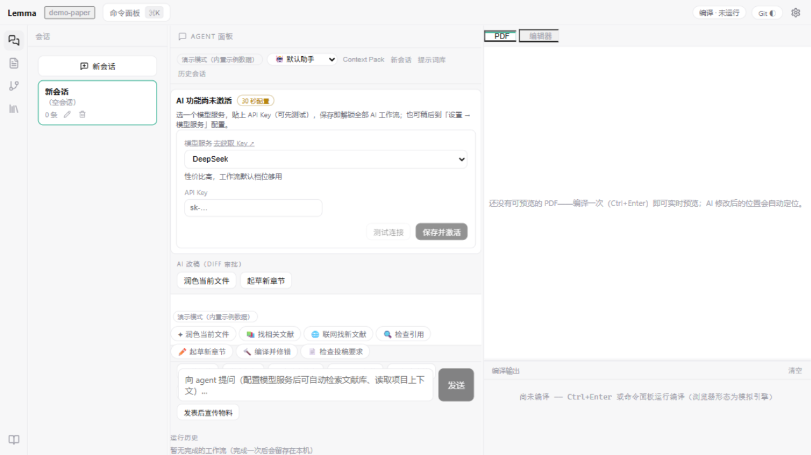
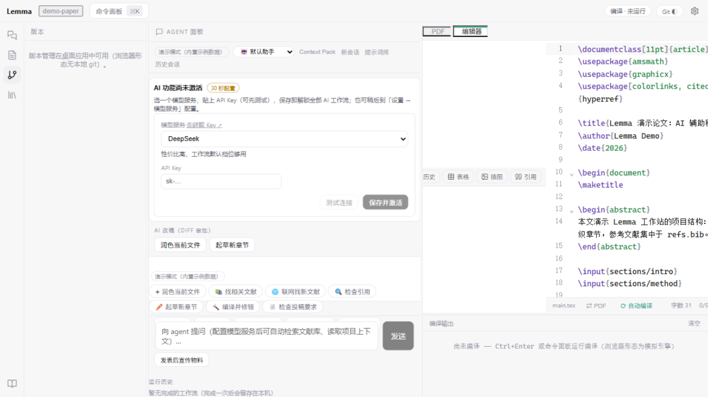

<div align="center">

# Lemma

**写 LaTeX 论文的 Codex · AI-native paper writing workspace**

*一个项目、多个 AI 会话、右侧实时 PDF——像用 Codex 写代码一样写论文。*

[](https://github.com/Xinzhe99/lemma/actions/workflows/ci.yml)
[]()
[](LICENSE)
[]()
[](https://v2.tauri.app)

**[🎯 定位](#-定位为什么是写论文的-codex) · [✨ 核心体验](#-核心体验) · [🤖 AI 能力](#-ai-能力) · [🚀 快速开始](#-快速开始) · [🏗 架构](#%EF%B8%8F-架构)**

</div>

---



*右侧一键切换 LaTeX 源码模式：*



---

## 🎯 定位：为什么是「写论文的 Codex」

AI 编码工具（Codex / Claude Code / Cursor）已经证明了一件事：**agent 能动手，比只能聊天有用得多**。但论文工具里的 AI 还被关在"对话框"里——看不到你的文献库，跑不了你的编译，改不了你的引用，更不会为改动负责。

Lemma 把 Codex 的产品形态完整搬到 LaTeX 论文场景：

| Codex（写代码） | Lemma（写论文） |
|---|---|
| 一个 repo 多个会话 | 一个论文项目多个 AI 会话（左侧列表管理，按项目隔离） |
| 中间是对话，右侧看代码/diff | 中间是对话，右侧**默认实时渲染的 PDF**（一键切 LaTeX 源码） |
| AI 改代码 → diff 审批 | AI 改稿件 → diff 审批卡，逐 hunk 勾选采纳 |
| git 版本管理，随时回滚 | **内置 git**：AI 每次采纳的改动自动提交，历史面板一键恢复 |
| agent 调工具（读文件/跑命令） | agent 调 16 个论文域工具（读 PDF 论文/联网找文献/编译/改稿/加引用…） |
| 闲时下载更新，确认后重启 | 同款更新体验，重启后会话与项目原地恢复 |

**不做冗余功能**：没有番茄钟、没有写作打卡、没有花哨面板——保留写作、编译、文献、AI 四件事，做到极致。

**设计语言与 Codex 完全同步**：明亮极简主题、药丸按钮、会话为中心的信息层级——AI 会话区是唯一主角，工作流/历史等次要功能默认折叠收纳入库。

## ✨ 核心体验

### 会话中心的写作流

- **一个项目，多个会话**：起草一个会话、审稿修改一个会话、rebuttal 一个会话——左侧列表随时切换，重启不丢（本地 IndexedDB 持久化）
- **编辑器 + PDF 同步并排**：中央左侧写、右侧实时预览（编辑 0.5s 自动重编译）；**重新编译不跳页**——你看的位置就是 AI 改的位置，所见即所得；AI 会话固定在最右一列
- **AI 改动自动定位**：AI 修改稿件并编译成功后，PDF 自动滚动到被修改的对应位置（SyncTeX 正向定位）

### 内置 git 版本管理

- **AI 改动自动提交**：每次 diff 审批采纳后 2s 自动 commit——AI 干的每一步都有版本可回滚，像 Codex 一样可靠
- **历史面板**：左侧「版本」页签查看提交历史，任何版本一键恢复（恢复本身也是新变更，可再回滚）
- **手动提交**：阶段性进度随时「提交当前进度」
- 桌面形态使用系统 git（研究人员机器几乎必装）；未检测到时面板明示并停用，不伪装

### 编译：开箱即用

- **无需预装 LaTeX**：全引擎矩阵（Tectonic / LuaLaTeX / XeLaTeX / pdfLaTeX / latexmk）自动检测，缺引擎时 Tectonic 自动下载（~30MB 零配置）；**启动闲时自动预备引擎并预热宏包缓存**——你第一次点编译时，引擎已经就绪
- **编译失败一键 AI 修复**：控制台「✦ AI 修复编译错误」→ 错误日志自动注入 → AI 逐个定位修复（走 diff 审批）→ 重新编译验证
- **SyncTeX 双向跳转**：PDF 点正文跳源码行，源码行跳 PDF 位置

## 🤖 AI 能力

Agent 可调用 **16 个论文域工具**，多轮自主执行（50 轮）：

| 类别 | 工具 | 说明 |
|---|---|---|
| 读文献 | `paper.read` | 读附件 PDF **全文**（分页标注 / 截断保护），无附件时题录+摘要兜底 |
| 找文献 | `web.search_scholar` | 联网聚合 arXiv + Crossref，检索库外新文献 |
| | `library.search_fulltext` | 全文级检索个人文献库（附件 PDF 已入索引） |
| 改稿件 | `tex.edit` / `tex.create_file` | diff / 整文件 / find-replace 三种方式，**强制经 diff 审批** |
| 加引用 | `citation.add` / `citation.validate` | 生成 BibTeX 入库（走审批）/ 悬空引用核查 |
| 编译 | `tex.compile` / `tex.last_errors` | 真实编译 + 错误日志回读 |
| 项目 | `project.context` / `read_file` / `find_in_files` / `list_files` | 大纲 / 术语表 / 文件读取与搜索 |
| 记忆 | `memory.write` | AI 自主写入项目约定与偏好，注入后续所有会话 |
| 修订历史 | `git.log` / `git.show` | AI 可读内置 git 的提交历史与变更明细——像 Prism 一样「在含历史修订的完整上下文中工作」 |
| 其他 | `snapshot.create` / `submission.checklist` | 快照 / 15 个期刊投稿要求查询 |

**Prism 式效率入口**：
- **文档级快捷操作**：AI 面板工具栏一键「总结全文 / 校对 / 查找文献」
- **图像转 LaTeX**：公式/表格截图（Ctrl+V 粘贴）→ 视觉模型转 LaTeX → 走 diff 审批插入稿件（支持 GLM-4V / gpt-4o / Qwen-VL 等视觉模型）

**为「AI 自主」配套的体验**：

- **智能上下文注入**：说"润色"自动附当前文件，说"引用"自动附 bib 键列表，说"编译错误"自动附日志；`@文件路径` / `@citekey` 提及即注入全文/论文内容
- **回复后建议 chips**：改完稿 → 「编译验证」；读过论文 → 「总结方法」；检索过 → 「导入文献」——零 API 成本，点击即发
- **AI 记忆**：审批历史学习写作偏好 + `memory.write` 主动记忆，跨会话生效，越用越懂你的项目
- **行内补全（ghost text）**：Tab 采纳，注入文档类 / 术语表 / 当前节上下文
- **四种角色**：默认助手 / 严格审稿人 / 写作教练 / 翻译专家
- **学术诚信护栏**：AI 回复中的每条引用与本地文献库核验，幻觉引用标红拦截；所有 AI 修改 latexdiff 留痕

**内置工作流**（斜杠命令呼出）：分节起草 / 学术润色 / 三审稿人仿真 / Rebuttal 起草 / 相关工作综述 / Cover Letter / 预提交自检 / Beamer 演示稿 / 页数压缩等 10 个。

**文献管理**：arXiv + Crossref 聚合检索入库、BibTeX/RIS/Zotero 迁移、PDF 四色语义标注、全库混合检索（BM25 + 向量，附件 PDF 全文入索引）、选中即问 AI。

## 🚀 快速开始

### 直接下载（推荐）

| 下载 | 说明 |
|---|---|
| [Windows 安装包](https://github.com/Xinzhe99/lemma/releases/latest) | NSIS 向导式 setup.exe |
| [macOS (Apple Silicon)](https://github.com/Xinzhe99/lemma/releases/latest) | .dmg |
| [macOS (Intel)](https://github.com/Xinzhe99/lemma/releases/latest) | .dmg |

全部版本见 [Releases](https://github.com/Xinzhe99/lemma/releases)。**应用内自动更新**：闲时静默检查下载，你确认后重启完成升级，会话与项目原地恢复。

### 从源码运行

```bash
git clone https://github.com/Xinzhe99/lemma.git
cd lemma
npm install

# Web 版（模拟编译，AI 需配置）
npm run dev

# 桌面版（完整体验：真实编译 / SyncTeX / 内置 git）
cd apps/desktop
npm run desktop:dev      # 开发运行（Tauri 窗口）
npm run desktop:build    # 打安装包
```

前置：[Rust](https://rustup.rs) + Node 20+。**无需预装 LaTeX 和 git 之外的东西**（LaTeX 引擎自动下载；git 缺失时版本面板自动降级）。

### 配置 AI（30 秒）

设置 → 模型服务 → 选预设（DeepSeek / 智谱 GLM / Kimi / 硅基流动 / 通义 / OpenAI / 自建）→ 粘贴 API Key → 测试连接。未配置时以演示模式运行（内置示例数据，明确标注）。

## 🏗️ 架构

```
apps/desktop            应用壳（Tauri 2 + React；Rust 桥：虚拟文件系统 / 密钥 / 进程调用 / 更新）
packages/shared         跨包领域类型
packages/editor         LaTeX 编辑器（CodeMirror 6 · 补全/大纲/linter/数学预览）
packages/compile        编译服务（引擎矩阵 · log 解析 · 真实 SyncTeX · 模板）
packages/library        文献库 + PDF 阅读器（BibTeX/RIS/Zotero 解析 · 引用格式）
packages/agent-hub      Agent 中枢（OpenAI 兼容流式 · 工具调用 · 阻塞审批 · 工作流引擎）
packages/knowledge      知识底座（RAG · Context Pack · 术语/风格 · 引用护栏）
```

**工程数据**：1990 个单元测试（168 文件）· GitHub Actions CI（web + cargo-check）· 中英双语 · 本地优先（IndexedDB，API key 永不入备份/外发）。

## 🗺 路线图

- [x] v1.x–v2.x 编辑器/编译/文献/工作流打底（详见 [CHANGELOG.md](CHANGELOG.md)）
- [x] v3.x–v4.x AI 自主化：16 工具 agent、全文检索、AI 记忆、性能分包（启动 -31%）
- [x] **v5.0 大改版：Codex 式重构**——会话中心布局 / PDF 默认实时渲染不跳页 / AI 改动自动定位 / 内置 git / 删除非核心功能
- [ ] 协同写作（CRDT 二阶段：实时云房间）
- [ ] AI 生图（论文插图向）

## 🤝 贡献

欢迎 Issue 与 PR。提交前请跑 `npm run typecheck && npm test`（与 CI 同款门禁）。版本历史见 [CHANGELOG.md](CHANGELOG.md)。

## 📄 许可

[MIT](LICENSE) © 2026 Lemma Contributors
