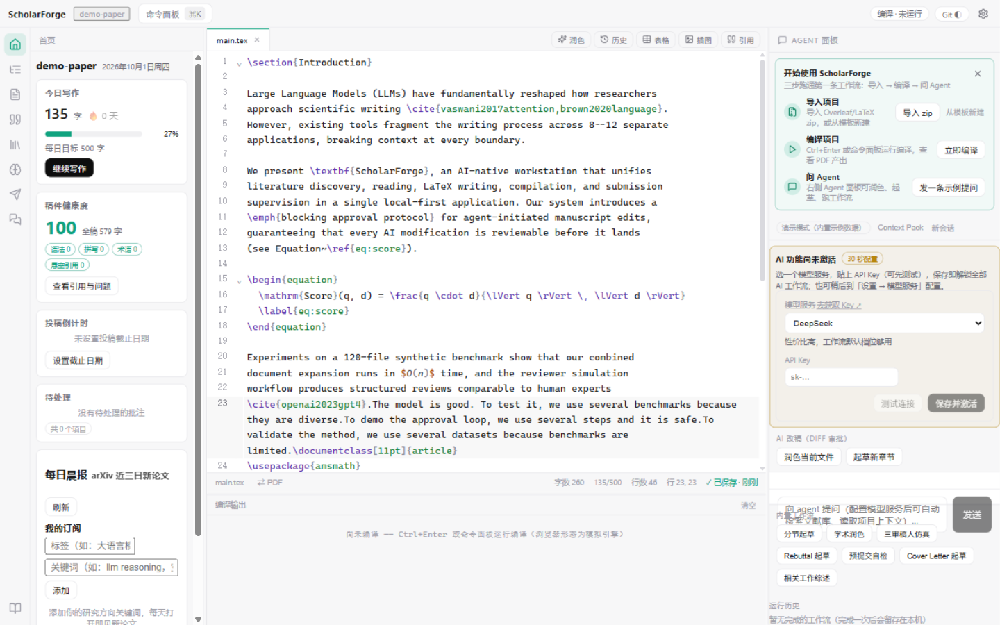
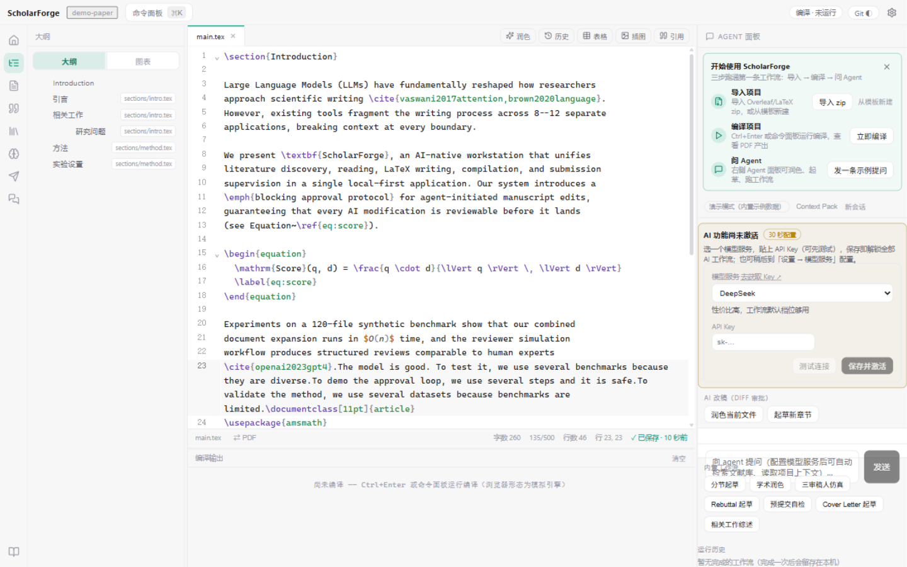
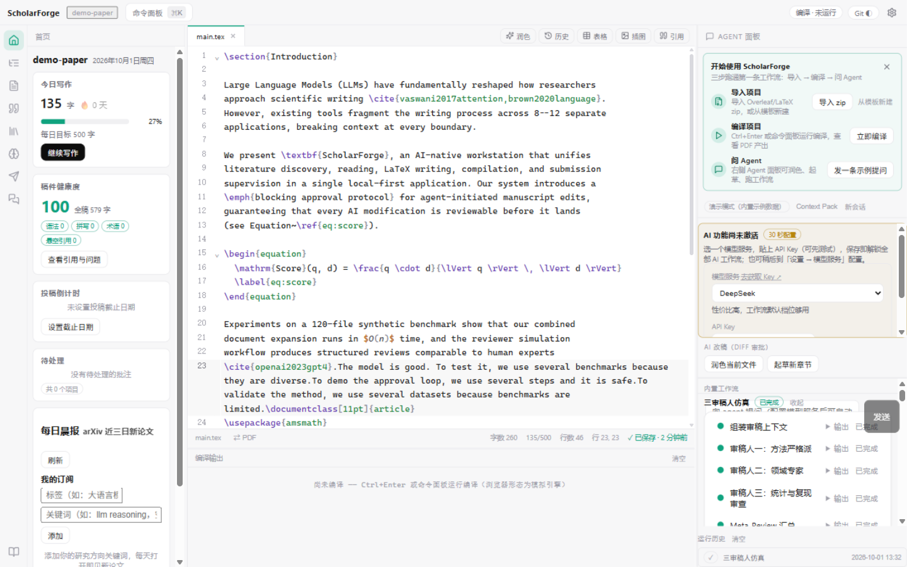
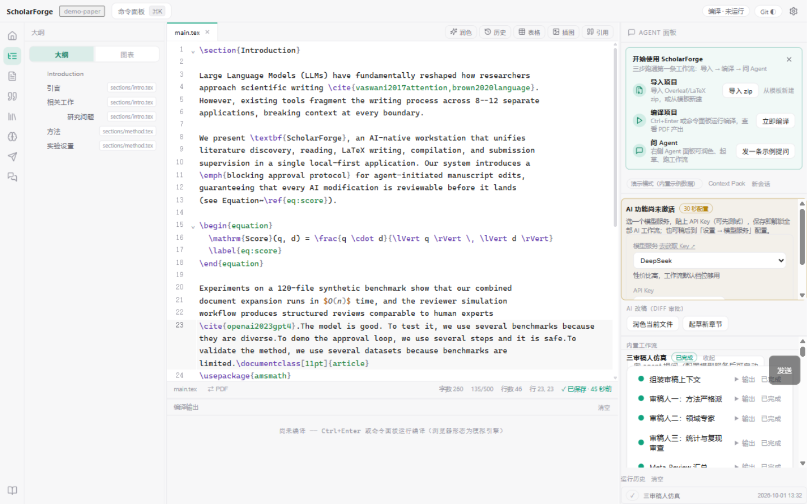
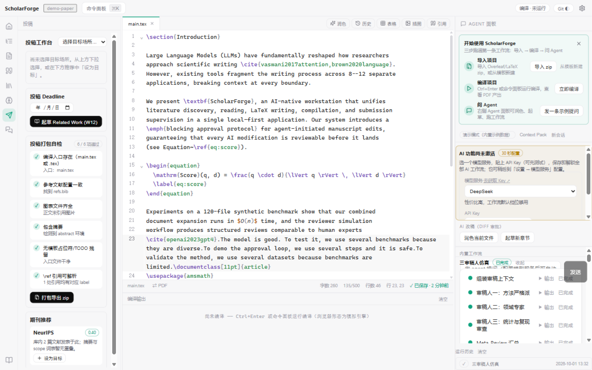

<div align="center">

# ScholarForge

**AI 原生的一站式学术论文写作工作站 · IDE for Papers**

*Literature discovery → reading → LaTeX writing → compilation → AI review → submission, in one local-first app.*

[](https://github.com/Xinzhe99/scholarforge/actions/workflows/ci.yml)
[]()
[](LICENSE)
[]()
[](https://v2.tauri.app)

**[✨ 功能总览](#-功能总览) · [🚀 快速开始](#-快速开始) · [🤖 AI 工作流](#-ai-工作流) · [🏗 架构](#-架构) · [🗺 路线图](#-路线图)**

</div>

---



---

## 为什么做这个

写一篇论文，今天的研究者要在 **8–12 个互不打通的工具**之间切换：Google Scholar 检索、Zotero 管理、Acrobat 阅读标注、Overleaf 写作、ChatGPT 润色、邮件里来回审稿意见……上下文在每一个边界断裂。

更关键的是：AI 编码工具（Cursor / Codex / Claude Code）已经证明"agent 能动手"的价值，但论文工具里的 AI 还被关在"只能聊天"的盒子里——看不到你的文献库，跑不了你的编译，改不了你的引用。

**ScholarForge 把这两件事缝合起来**：一个本地优先的桌面应用，AI Agent 作为一等公民深入每个环节——能读你的文献库、能编译你的论文、能核查你的引用、能模拟你的审稿人。而每一次 AI 修改都以 diff 呈现、由你审批。

## ✨ 功能总览

### 📝 写作环境（Overleaf 级 + 本地编译）

| | |
|---|---|
| LaTeX 编辑器 | 语法高亮、代码折叠、`\cite` / `\ref` 智能补全（数据来自你的文献库）、BibTeX 专用高亮 |
| 数学实时预览 | 悬停 `$...$` / `\[...\]` 即出 KaTeX 渲染浮层 |
| 可视化工具 | 表格编辑器（图形网格 → tabular 代码）、插图向导（自动补 `graphicx`）、引用插入向导（语义推荐相关文献） |
| 质量护栏 | LaTeX linter（环境配对/悬空引用/括号平衡）、拼写与学术用词检查（96 对错拼 + 26 组易混词，语境守卫防误报） |
| 真实编译 | 自动探测本机 Tectonic / latexmk，产物直接在应用内预览 PDF；**SyncTeX 双向跳转**（点 PDF 回源码行 / 状态栏 ⇄ 按钮跳 PDF） |
| 效率特性 | Ctrl+P 快速打开、Ctrl+Shift+F 全项目搜索、编辑器字号、专注模式、多项目管理、快照时间线 |



### 📚 文献管理（Zotero 级 + AI 检索）

- **文献发现**：arXiv + Crossref 聚合检索一键入库；**arXiv 每日晨报**（订阅研究方向，打开即见近三日新论文）
- **迁移导入**：BibTeX / RIS / DOI / arXiv ID / **Zotero Better BibTeX JSON**（集合结构保留为标签）；PDF 文件夹批量模糊关联
- **PDF 阅读**：四色语义标注（方法/发现/质疑/引用）、书签大纲、连续滚动（虚拟化）、选中即问 AI
- **知识底座**：全库混合检索（BM25 + 向量）、双链笔记卡片（标注一键转卡片）、术语表与一致性检查、写作风格档案

### 🏠 首页指挥台

打开应用第一眼即见"今天该做什么"：今日写作目标与连续天数、**稿件健康度评分**（lint / 拼写 / 术语 / 悬空引用四维聚合 0–100）、投稿倒计时、待处理批注、arXiv 晨报。



## 🤖 AI 工作流

7 个内置工作流贯穿"写 → 审 → 辩 → 投"全流程。Agent 可调用论文域工具（检索文献库、读项目上下文、触发编译）；**写级操作（改稿 / 加引用）强制经 diff 审批卡，你裁决后才落盘**，并自动创建快照随时回滚。

| 工作流 | 做什么 |
|---|---|
| **W6 三审稿人仿真** | 三个独立 persona（方法严格派 / 领域专家 / 统计复现）并行审稿 + Meta-Review 三档优先级 → 结构化审稿面板 |
| **W7 Rebuttal 起草** | 逐条解析审稿意见 → direct-fix / partial / argue / cite 四类策略回复 → 经审批插入稿件 |
| **W12 相关工作综述** | 从你的文献库检索分组 → Related Work 叙事草稿（引用全部本地可验证） |
| **W3 学术润色** | 目标化润色 + diff 审批 + 自动快照 |
| **W2 分节起草** | 注入 Context Pack 与相关文献起草章节 |
| **W10 预提交自检** | 三态清单报告（问题行一键跳转、修复建议一键复制） |
| **W11 Cover Letter** | 结合期刊定位起草投稿信 |

**学术诚信护栏**：AI 回复中的每条引用与本地文献库核验，幻觉引用立即标红拦截；所有 AI 修改 latexdiff 留痕；全量备份不含 API key。

**零配置也能体验**：内置演示模式（高质量示例数据、明确标注）——装完即看三审稿人仿真的完整形态；配好 key 后 30 秒切换为真实 AI（DeepSeek / GLM / Kimi 等 7 家预设 + 连接测试）。



### 📤 投稿工作台

15 个内置期刊/会议档案（页数 / 匿名规则 / AI 政策）、打包自检 6 项门控、一键导出 zip、Cover Letter、deadline 倒计时三档预警、期刊推荐。



## 🚀 快速开始

### 方式一：Web 版（无需安装 Rust）

```bash
git clone https://github.com/Xinzhe99/scholarforge.git
cd scholarforge
npm install
npm run dev        # 打开 http://localhost:5173
```

> Web 版为模拟编译、AI 需配置模型服务；完整体验（真实编译 / SyncTeX / 晨报直连）建议桌面版。

### 方式零：直接下载安装包（Windows，推荐）

| 下载 | 说明 |
|---|---|
| [ScholarForge_0.9.0_x64-setup.exe](https://github.com/Xinzhe99/scholarforge/releases/download/v0.9.0/ScholarForge_0.9.0_x64-setup.exe) | 安装包（2.8 MB，NSIS 向导式安装） |
| [scholarforge-portable-0.9.0.exe](https://github.com/Xinzhe99/scholarforge/releases/download/v0.9.0/scholarforge-portable-0.9.0.exe) | 绿色单文件版（4.8 MB，免安装双击即用） |

全部版本见 [Releases](https://github.com/Xinzhe99/scholarforge/releases)。

### 方式二：桌面版（Windows）

**前置**：[Rust](https://rustup.rs) + Node 20+；建议装有 Tectonic 或 TeX Live（缺失自动回退模拟编译）

```bash
npm install
cd apps/desktop
npm run desktop:dev     # 开发运行（Tauri 窗口）
npm run desktop:build   # 打安装包（NSIS setup.exe）
```

### 配置 AI（30 秒）

设置 → 模型服务 → 选预设（DeepSeek / 智谱 GLM / Kimi / 硅基流动 / 通义 / OpenAI / 自建）→ 粘贴 API Key → 测试连接。未配置时全部工作流以演示模式运行。

## 🏗 架构

```
apps/desktop            应用壳（Tauri 2 + React；Rust 桥：虚拟文件系统 / 密钥 / 进程调用）
packages/shared         跨包领域类型
packages/editor         LaTeX 编辑器（CodeMirror 6 · 补全/大纲/linter/数学预览/表格）
packages/compile        编译服务（Tectonic/latexmk · log 解析 · 真实 SyncTeX · 模板）
packages/library        文献库（BibTeX/RIS/Zotero 解析 · PDF 阅读器 · 引用格式）
packages/agent-hub      Agent 中枢（OpenAI 兼容流式 · 工具调用 · 阻塞审批 · 工作流引擎）
packages/knowledge      知识底座（RAG · Context Pack · 术语/风格 · 引用护栏）
```

**工程数据**：1165 个单元测试（113 文件）· GitHub Actions CI（web + cargo-check 双 job）· 全站中英双语 · 数据本地优先（IndexedDB，API key 永不入备份/外发）。

## 🗺 路线图

- [x] v0.5 数学预览 · SyncTeX · 全项目搜索 · ErrorBoundary · CI
- [x] v0.6 引用向导 · PDF 大纲与连续滚动 · 备份恢复 · W12 综述
- [x] v0.7 批注系统 · 写作统计 · 专注模式 · 图表导航 · 拼写检查
- [x] v0.8 数据持久化 · 模型激活器 · 真实 SyncTeX 校准 · 性能基线 · 安装包
- [x] v0.9 首页指挥台 · arXiv 晨报 · 离线演示模式 · Zotero 迁移
- [ ] 审阅包往返（导出/导入给合作者，导师不装软件也能改稿）
- [ ] 实时多人文档协同（Yjs CRDT + 可选云房间）
- [ ] CLI agent 桥（Codex / Claude Code 作为宿主引擎接入）

## 🤝 贡献

欢迎 Issue 与 PR。提交前请跑 `npm run typecheck && npm test`（与 CI 同款门禁）。完整设计文档见 [DESIGN.md](./DESIGN.md)，版本历史见 [CHANGELOG.md](./CHANGELOG.md)。

## 📄 许可

[MIT](LICENSE) © 2026 ScholarForge Contributors
