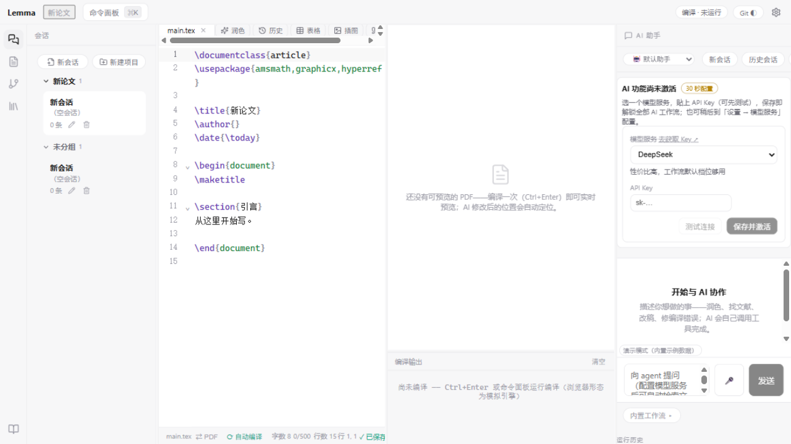

<div align="center">


# Lemma

**写 LaTeX 论文的 Codex · AI 原生论文写作工作站**

[English](README.md) · **[简体中文](README.zh-CN.md)**

*一个项目、多个 AI 会话、实时 PDF 预览——像用 Codex 写代码一样写论文。*

[](https://github.com/Xinzhe99/lemma/actions/workflows/ci.yml)
[](https://github.com/Xinzhe99/lemma/releases/latest)
[](LICENSE)
[](https://github.com/Xinzhe99/lemma/releases/latest)
[]()
[](https://v2.tauri.app)
[]()
[]()

[](https://starchart.cc/Xinzhe99/lemma)

**[功能](#-功能) · [下载](#-下载) · [快速开始](#-快速开始) · [架构](#%EF%B8%8F-架构) · [参与贡献](#-参与贡献)**

</div>

---

## 📸 界面

| 写作与实时预览 | AI 会话 |
|:---:|:---:|
|  |  |

## 🎯 为什么做 Lemma

AI 编码工具（Codex / Claude Code / Cursor）证明了一件事：**能动手的 agent 比只会聊天的对话框有用得多**。但论文工具里的 AI 仍被关在对话框里——看不到你的文献库，跑不了你的编译，改不了你的引用，更不会为改动负责。

Lemma 是**为 LaTeX 论文重建的 Codex**：

| Codex（写代码） | Lemma（写论文） |
|---|---|
| 一个仓库多个会话 | 一个论文项目多个 AI 会话 |
| 中间对话、右侧代码 | 编辑器 + **实时 PDF** 并排，右侧 AI 会话 |
| AI 改代码 → diff 审批 | AI 改稿件 → diff 审批、逐块采纳 |
| 内置 git 随时回滚 | 内置 git：AI 每次改动自动提交、一键恢复 |
| agent 调工具 | agent 调 **19 个论文域工具**（读 PDF、联网检索、编译、引用…） |
| 闲时更新、重启恢复 | 同款更新体验；重启后会话与项目原地恢复 |

没有番茄钟、没有打卡面板——只有写作、编译、文献和 AI。

## ✨ 功能

### 🖋 写作环境

- **编辑器 + 实时 PDF 并排**——0.5 秒自动重编译；**重新编译不跳页**；AI 修改后 PDF 自动滚动到对应位置（SyncTeX 正向定位）
- **PDF 全文搜索**——输入即搜，Enter/Shift+Enter 在命中页间循环
- **PDF 批注**——四色语义高亮；逐条「待处理/已处理」；一键把未处理批注发给 AI 起草逐条回复信
- **全引擎矩阵**——Tectonic / LuaLaTeX / XeLaTeX / pdfLaTeX / latexmk 自动检测；缺引擎自动下载 Tectonic（约 30MB 零配置），**启动闲时预热**——首次编译零等待
- 编译失败一键 **✦ AI 修复**

### 🤖 AI（Lemma 的核心）

agent 可调用 **19 个工具**，最多 50 轮自主执行：

| 类别 | 工具 |
|---|---|
| 读文献 | `paper.read`——附件 PDF 全文（分页、截断保护） |
| 找文献 | `web.search_scholar`（arXiv + Crossref）、`library.search_fulltext`（全库全文检索） |
| 改稿 | `tex.edit` / `tex.create_file`——一律走 diff 审批 |
| 引用 | `citation.add` / `citation.validate`——幻觉 `\cite` 自动标红拦截 |
| 编译 | `tex.compile` / `tex.last_errors` |
| 项目 | `project.context` / `project.read_file` / `project.find_in_files` / `project.list_files` |
| 记忆与历史 | `memory.write`——AI 记住你的写作约定，跨会话生效；`git.log` / `git.show`——AI 能读懂自己的改动历史 |
| 投稿与安全 | `submission.checklist`（期刊要求）、`snapshot.create`（写前快照）、`user.ask`（必须由人拍板时的一次结构化提问） |

另有 3 个工具已在注册表中但本形态未接通（`library.search`、`paper.citations`、`figure.render`），调用会返回明确的「未接通」说明。

**输入通道**：文字、🎤 语音（Whisper 纯本地）、📎 图片（多模态）、**任意文件**（拖入 PDF / Word / CSV，内容自动提取注入）。**输出**：稿件修改（走审批）、TikZ 图表（编译预览）、排版视觉检查（✦ AI 查此页）、朗读校对（TTS）。

### 📚 文献与审阅

- Zotero 一键同步（Better BibTeX 端点）、BibTeX/RIS/DOI/arXiv 导入
- 混合全文检索（BM25 + 向量；附件 PDF 已入索引）
- 导师往返：导入 Word/PDF 批注 → 逐条勾销 → AI 起草逐条回复信

### 🔖 版本管理（内置 git）

- AI 改动（审批采纳后）**自动提交**（2 秒防抖）
- 历史面板：逐行 diff、**红删蓝增 changes.pdf**（latexdiff 本地等价，导师审阅用）、一键恢复
- GitHub 同步：关联自己的仓库 → Push / Pull（凭据走系统 git）

### 🛠 更多

- 20 个内置模板（IEEE/ACM 观感、Elsevier/数学期刊、arXiv、学位论文、中文期刊、Beamer ×2、A0 海报、Cover Letter…）
- 语音转文字（Whisper 本地，首次下载后离线可用）
- Codex 式自动更新：闲时检查 → 后台下载 → 确认 → 重启恢复一切
- 中文 / English 界面切换

## 📥 下载

| 平台 | 链接 |
|---|---|
| Windows | [Lemma_x64-setup.exe](https://github.com/Xinzhe99/lemma/releases/latest) |
| macOS（Apple Silicon） | [Lemma_aarch64.dmg](https://github.com/Xinzhe99/lemma/releases/latest) |
| macOS（Intel） | [Lemma_x64.dmg](https://github.com/Xinzhe99/lemma/releases/latest) |

全部版本：[Releases](https://github.com/Xinzhe99/lemma/releases)

## 🚀 快速开始

### 从源码运行

```bash
git clone https://github.com/Xinzhe99/lemma.git
cd lemma
npm install
npm run dev            # 网页预览（模拟编译）
# 或桌面版：
cd apps/desktop && npm run desktop:dev
```

前置：Rust + Node 20+。**无需预装 LaTeX**（Tectonic 自动下载）；git 可选（无则版本面板自动降级）。

### 配置 AI（30 秒）

设置 → 模型服务 → 选预设（DeepSeek / 智谱 GLM / Kimi / 通义 / OpenAI / 自建）→ 粘贴 API Key → 测试连接。未配置时以演示模式运行。

## 🏗️ 架构

```
apps/desktop            应用壳（Tauri 2 + React；Rust 桥：虚拟文件系统 / 密钥 / 进程 / 更新器）
packages/shared         跨包领域类型
packages/editor         LaTeX 编辑器（CodeMirror 6）
packages/compile        编译服务（引擎矩阵 · 日志解析 · 真实 SyncTeX · 模板）
packages/library        文献库 + PDF 阅读器
packages/agent-hub      Agent 中枢（流式 · 工具 · 阻塞审批 · 工作流）
packages/knowledge      RAG · Context Pack · 引用护栏
```

**工程数据**：2,350 个单元测试（205 文件）· GitHub Actions CI（web + cargo-check）· 中英双语 · 本地优先（IndexedDB，API Key 永不离开本机）。

## 🗺 路线图

- [x] v1–v4：编辑器/编译/文献/工作流打底；v4.2：主 bundle 2006KB → 1375KB（-31%）
- [x] v5：**Codex 式重构**——会话中心、实时 PDF、内置 git、功能删减
- [x] v6：图片/语音/文件三通道输入，视觉检查与 TTS 输出
- [x] v7：多 agent 深度评审——22 个确认 bug 全修复
- [x] v7.8：全量缺陷审查（7 路并行）——修复 90+ 项，含数据丢失竞态与 20 个模板中的 11 个（其中 9 个根本无法编译）
- [ ] 实时多人协同（需要信令服务器）
- [ ] AI 科研绘图生成

## 🤝 参与贡献

欢迎 Issue 与 PR。提交前请跑 `npm run typecheck && npm test`（与 CI 同款门禁）。完整版本历史见 [CHANGELOG.md](CHANGELOG.md)。

## 📄 许可

[MIT](LICENSE) © 2026 Lemma Contributors
